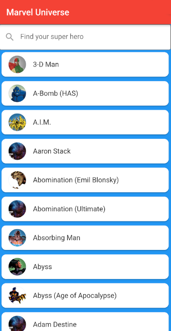
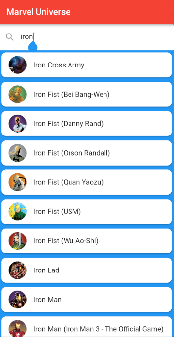

# Marvel Universe

Marvel Universe is a small wiki to seek information about Marvel's heroes and villains.

## Launch

To launch the app in debug mode, run `flutter run`

##Install on an Android device

_Note: be sure to have your device connected_

```bash
flutter build apk
flutter install
```

## Gallery



_The home screen of the app._



_You can filter characters using the search bar._


_By clicking on a character's card, you can see their description (if available)._

## Contributing

Pull requests are welcome.
